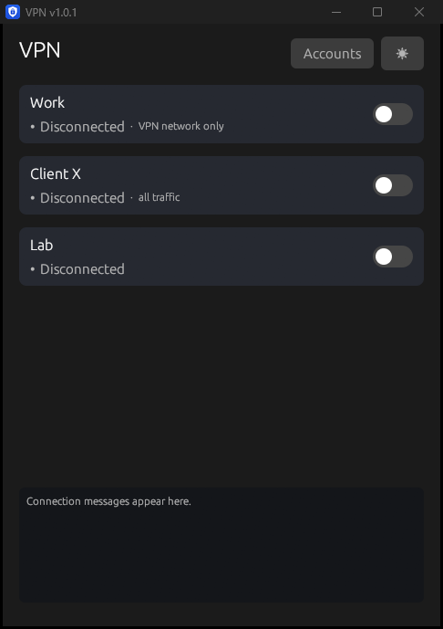
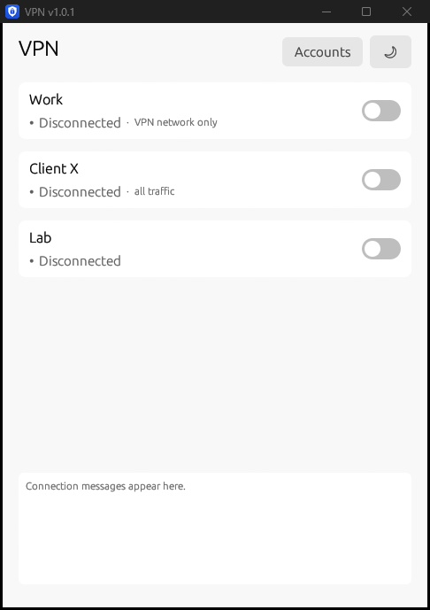
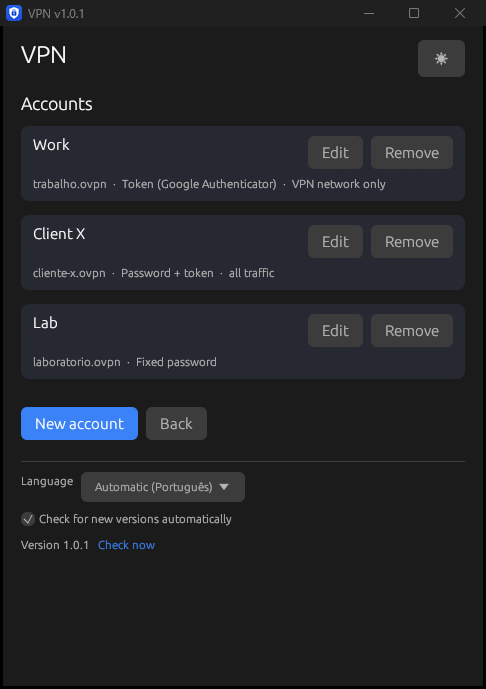
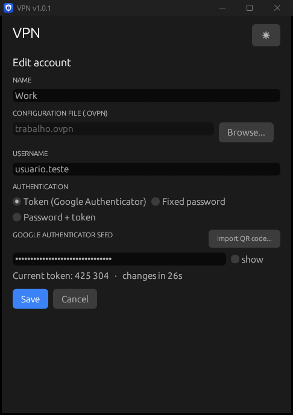
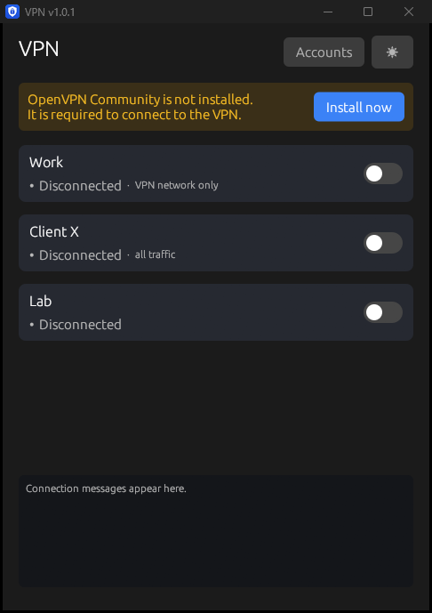
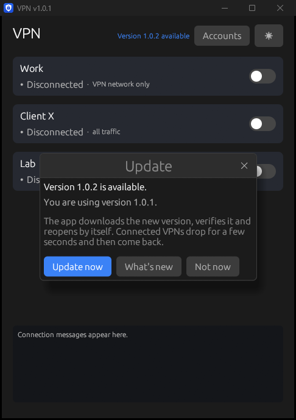

<p align="center">
  
</p>

<h1 align="center">VPN</h1>

<p align="center"><b>English</b> | <a href="README.pt-BR.md">Português</a></p>

<p align="center">
  <a href="https://github.com/Antxj/vpn/releases/latest"></a>
</p>

Windows app that connects to one or **several OpenVPN VPNs at the same
time**, generating the Google Authenticator token automatically — no need to
open the phone app for every connection. If a connection drops, it
reconnects by itself with a fresh token.

Written in **Rust**: a single ~12 MB native executable that already ships the
official OpenVPN installer — nothing needs to be installed beforehand.

The interface is available in English and Brazilian Portuguese, following
the Windows language (it can be set under **Accounts** › Language).

| Dark theme | Light theme |
|---|---|
|  |  |

| Accounts | Edit account |
|---|---|
|  |  |

If OpenVPN Community is not installed, the app shows a notice and installs it
silently from the embedded official installer (the check runs every 5
seconds — as soon as OpenVPN is found, the notice goes away):



## How it works

Each account has a name, an `.ovpn` file, a username and an authentication
method. When an account's toggle is switched on, the app starts a dedicated
`openvpn.exe` for it with the management interface enabled (`--management` +
`--management-query-passwords`) and answers every username/password prompt
with the account's password. When the account uses a token, it is generated
(TOTP, RFC 6238) **on every** authentication prompt — so the initial
connection, periodic renegotiations and reconnections after a drop all work
without user intervention.

- **Multiple accounts**: each with its own toggle on the home screen, status,
  IP and traffic; several can be connected at the same time
- **Three authentication methods** per account: token (Google
  Authenticator), fixed password, or password + token (the password followed
  by the 6-digit code)
- **Accounts screen**: add, edit and remove; the editor shows the
  current token so it can be compared with the phone before saving
- **System tray**: closing or minimizing does not disconnect. The icon
  summarizes all accounts (green: connected and none in transition; amber:
  some connecting or reconnecting; gray: none connected), the tooltip lists
  each connection, and the right-click menu toggles each account, plus
  "Disconnect all" and "Exit"
- **Simultaneous connections**: each one needs its own virtual network
  adapter; if all are in use, the app creates another one (with OpenVPN's own
  `tapctl.exe`) and retries
- **Full tunnel and split tunnel together**: each card shows whether the VPN
  carries **all traffic** (full tunnel) or **only the VPN's network** (split
  tunnel) — the app learns this on the first connection, from the routes the
  server created. One of each can be on at the same time, in any order: before
  starting a split-tunnel VPN, the app pins a direct route (through the local
  network) to its server, so it does not drop when the full-tunnel one
  connects (details in [Routes](#routes))
- **Conflicting routes warning**: if two accounts send all traffic through
  the VPN, the app warns before connecting the second one — only the last one
  would work as the default route
- **English or Portuguese**: follows the Windows language; either one can be
  set under **Accounts** › Language
- **QR code import**: the same QR code used to enroll Google Authenticator
  fills in the username and seed (image file or pasted screenshot)
- **Single instance**: opening the exe again just restores the existing
  window
- **Embedded OpenVPN installer**: users without OpenVPN solve it with one
  click — the app runs the official OpenVPN Inc. MSI (redistributed
  unmodified, see [LICENCAS-TERCEIROS.txt](LICENCAS-TERCEIROS.txt)) in silent
  mode, installing only the core, the service and the TAP-Windows6 driver —
  deliberately **without** the OpenVPN GUI, which would add a second VPN icon
  to the tray
- Accounts (username, seed and password) are stored encrypted with **DPAPI**
  (bound to the Windows account that saved them)
- The original `.ovpn` files are used without any modification
- **Unobtrusive updates**: once a day the app checks this repository's
  [Releases](../../releases); when there is a new version, a link appears at
  the top of the window and an item in the tray menu. "Update now"
  downloads, verifies and replaces the executable, reopens the
  app and reconnects the VPNs that were on (details in [Updates](#updates))

## Requirements

- **Windows 10 or 11** with DirectX 12 support
- The `.ovpn` configuration file of each VPN
- For token accounts: the seed (the base32 key from the Google Authenticator
  enrollment — or the QR code itself)

OpenVPN Community does **not** need to be installed: the app installs it if
missing (and uses the existing installation when there is one).

The app runs **as administrator** — OpenVPN needs this to create the network
connection. The executable itself asks Windows for permission (UAC prompt)
when it starts; if for some reason it runs without it, a notice appears in
the window.

## For users

1. Download `VPN.exe` from the [Releases](../../releases) page
2. Open it and accept the administrator prompt
3. If the yellow notice appears, click **Install now** and wait ~1 minute
4. Under **Accounts** › **New account**, pick the `.ovpn` file, enter the
   username and authentication (or use **Import QR code…**) and save
5. On the home screen, switch the account's toggle on

On the first run, Windows SmartScreen may warn about an "unrecognized app":
click **More info** › **Run anyway**.

Detailed instructions (in Portuguese) in [LEIA-ME.txt](LEIA-ME.txt).

## For developers

Requirements: [Rust](https://rustup.rs) (toolchain
`stable-x86_64-pc-windows-gnu`) and MinGW-w64 ([WinLibs](https://winlibs.com))
on the PATH — or the MSVC toolchain with Visual Studio Build Tools.

```powershell
cd rust
cargo test               # TOTP, accounts, state, adapters, QR, MSI, updates, routes, language
cargo test -- --ignored rota_direta   # creates and removes a real route (needs admin)
.\build-release.ps1      # downloads and verifies the MSI, tests and builds the release (~12 MB)
```

`build-release.ps1` is the **only** correct way to build a release: it
downloads the official OpenVPN installer (`rust/assets/openvpn.msi`, not in
the repository), verifies its SHA-256 and OpenVPN Inc. signature, removes
local paths from the binary and validates the result. A plain
`cargo build --release` produces an executable **without** the embedded
installer and with machine paths.

Structure:

- [`main.rs`](rust/src/main.rs) — user interface (egui/WGPU with DirectX 12)
  and tray
- [`motor.rs`](rust/src/motor.rs) — accounts and active connections (used by
  the interface and by the tray menu)
- [`vpn.rs`](rust/src/vpn.rs) — one connection: `openvpn.exe` thread,
  management interface and on-demand adapter creation
- [`estado.rs`](rust/src/estado.rs) — shared per-account state and log;
  written by the connections, read by the interface and the tray
- [`contas.rs`](rust/src/contas.rs) — account model, authentication and
  validation
- [`dpapi.rs`](rust/src/dpapi.rs) — encryption and persistence
- [`rotas.rs`](rust/src/rotas.rs) — direct route to the server and tunnel
  type detection (Windows IP Helper)
- [`i18n.rs`](rust/src/i18n.rs) — language (Portuguese/English) and the
  `tr!`/`trf!` text macros
- [`atualizacao.rs`](rust/src/atualizacao.rs) — checking for and installing
  new versions (WinHTTP, SHA-256 via BCrypt and signature via WinVerifyTrust)
- [`totp.rs`](rust/src/totp.rs) (RFC 6238), [`qr.rs`](rust/src/qr.rs),
  [`installer.rs`](rust/src/installer.rs), [`single.rs`](rust/src/single.rs)

Useful variables for development and testing:

| Variable | Effect |
|---|---|
| `VPN_DEV_NOUAC=1` (at build time) | builds an executable that does not request UAC |
| `VPN_OPENVPN` | points to an alternative `openvpn.exe` (non-existent = forces the notice) |
| `VPN_INSTANCIA` | separates a test instance from the everyday app |
| `VPN_SKIP_HINT` | does not show the first-time tray notification |
| `VPN_CAPTURA` | documentation screenshots: hides the administrator notice; with `contas`, `editar`, `nova` or `atualizacao`, opens directly on that screen |
| `VPN_IDIOMA` | forces `pt` or `en` (screenshots) |
| `VPN_ATUALIZACAO_URL` | queries another address instead of the GitHub API (update tests) |
| `APPDATA` | redirect to a test folder so the real accounts are not touched |

## Updates

There is no dedicated server: the app queries
`api.github.com/repos/Antxj/vpn/releases/latest` 30 seconds after opening and
then once a day. That endpoint ignores pre-releases, so a version only reaches
users when it is published as final. The request sends no user data (GitHub
only sees the IP address and the app version in the User-Agent) and can be
turned off under **Accounts** › "Check for new versions automatically".

Nothing opens by itself: when there is a new version, only the blue
"Version X available" link appears at the top of the window (plus an item in
the tray menu). The window below only opens when the user clicks it:



When the user clicks **Update now**:

1. the release's `VPN.exe` is downloaded and only accepted if it has exactly
   the SHA-256 that GitHub publishes for the asset;
2. if the running executable is digitally signed, the new one must have a
   valid signature **from the same publisher** — from the first signed
   version on, no unsigned version is ever installed;
3. the current executable is renamed to `VPN.exe.antigo` (deleted on the
   next start) and the new one takes its place;
4. the app disconnects the VPNs and closes; the new version opens by itself
   and reconnects the accounts that were connected.

## Routes

There are two kinds of VPN:

- **full tunnel**: all internet traffic goes through the VPN — the server
  sends `redirect-gateway` and OpenVPN creates the `0.0.0.0/1` and
  `128.0.0.0/1` routes through the VPN;
- **split tunnel**: only the company networks go through the VPN; everything
  else uses the regular internet connection.

One of each at the same time works, because Windows always uses the most
specific route. The problem was a different one: when the full-tunnel VPN
connected, the split-tunnel VPN's traffic **to its own server** started going
through the other VPN, and it dropped. So, before starting a VPN that is not a
full tunnel, the app creates a `/32` route to each server in the `.ovpn` file
through the local network gateway (ignoring VPN adapters). The route is
removed when the connection ends, never survives a Windows restart, and is
recreated if the local network changes while connected (e.g. a laptop moving
to another Wi-Fi). Servers with internal addresses (10.x, 172.16–31.x,
192.168.x, 100.64–127.x) are not pinned: they are only reachable through
the local network itself or through another VPN.

Each VPN's type is learned when it connects: the app checks whether its
adapter received the default route (or both halves `0.0.0.0/1` +
`128.0.0.0/1`). This also covers the common case where `redirect-gateway`
comes from the server rather than from the file. The result is saved in the
account, shown on the card and used by the two-full-tunnels warning. Changing
the account's `.ovpn` file clears the saved type.

Known limitation: with both connected, internal names of the split-tunnel VPN
(such as `intranet.company.local`) may stop resolving if the full-tunnel VPN
takes over DNS. If that happens, please open an issue.

## Security

- Seeds and passwords are **never** stored in plain text: only encrypted via
  DPAPI in `%APPDATA%\VPN\contas.dat`
- No password/token is written to a file — the password is sent to OpenVPN
  through the management interface, which listens only on `127.0.0.1`
- Each OpenVPN connection log is kept in `%APPDATA%\VPN\logs\` (useful for
  support); at the usual log levels (`verb` up to 4) OpenVPN does not log
  passwords or tokens
- User interface startup failures are logged in
  `%APPDATA%\VPN\startup-error.log`; the log only contains technical details
  of the graphics initialization
- `.ovpn` files are in `.gitignore` (they contain private keys) — **never**
  commit them to this repository

## Privacy

The app does not collect or send user data. Its only network connections are:

- the **VPNs configured by the user** (servers defined in each account's
  `.ovpn` file);
- the **check for new versions** on GitHub (described in
  [Updates](#updates)), which sends no user data — GitHub only sees the IP
  address and the app version — and can be turned off under **Accounts** ›
  "Check for new versions automatically". The
  [GitHub privacy statement](https://docs.github.com/site-policy/privacy-policies/github-general-privacy-statement)
  applies.

Accounts, passwords and seeds stay on the computer only, encrypted (see
[Security](#security)).

## Uninstalling

The app has no installer: exit it (tray › **Exit**) and delete `VPN.exe`. To
also remove the saved accounts and logs, delete the `%APPDATA%\VPN` folder.
If OpenVPN Community was installed by the app, it can be removed under
**Windows Settings › Apps › Installed apps › OpenVPN**.

## Code signing policy

Free code signing provided by [SignPath.io](https://about.signpath.io),
certificate by [SignPath Foundation](https://signpath.org).

- Committers and reviewers: [Antxj](https://github.com/Antxj)
- Approvers: [Antxj](https://github.com/Antxj)

Signed executables are built exclusively by the
[release workflow](.github/workflows/release.yml) on GitHub Actions, from the
source code in this repository, and each release is manually approved before
signing. Privacy: see [Privacy](#privacy).

## License

[GPL-3.0-or-later](LICENSE). Third-party components (the official OpenVPN
installer, Rust libraries and fonts) and their licenses are listed in
[LICENCAS-TERCEIROS.txt](LICENCAS-TERCEIROS.txt).
