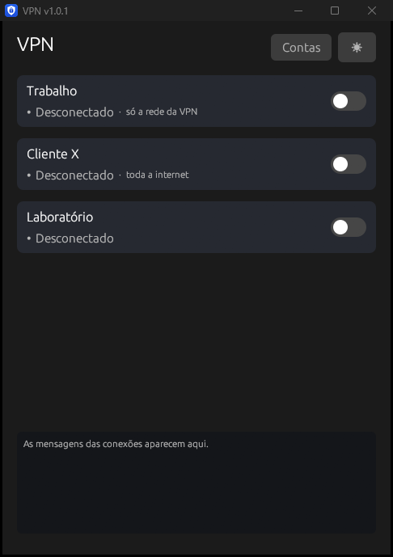
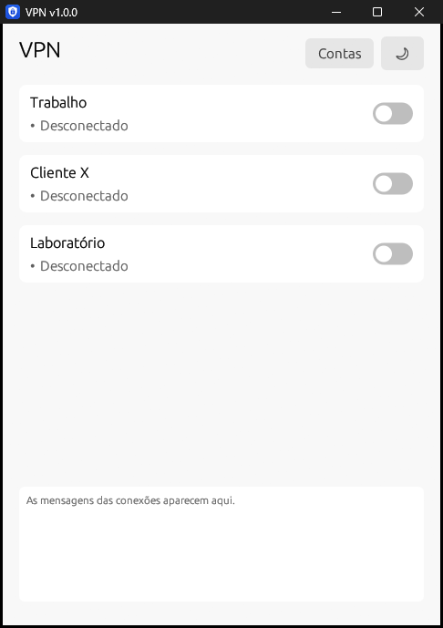
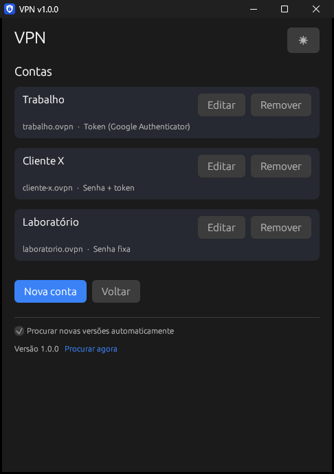
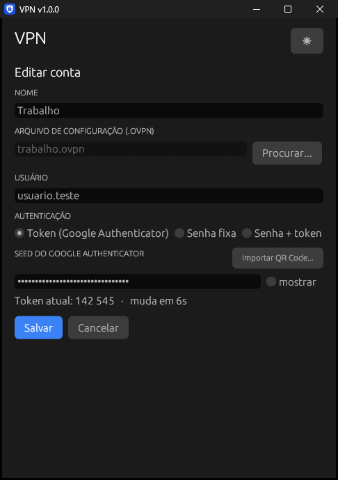
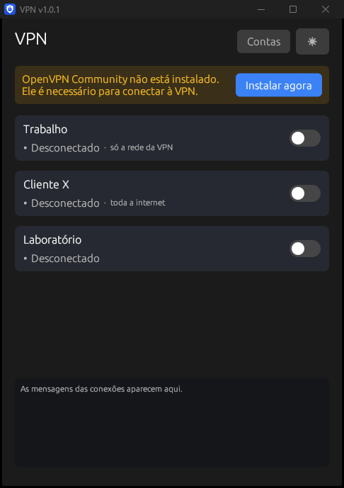
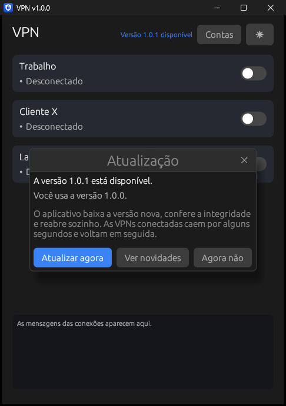

<p align="center">
  
</p>

<h1 align="center">VPN</h1>

<p align="center"><a href="README.md">English</a> | <b>Português</b></p>

<p align="center">
  <a href="https://github.com/Antxj/vpn/releases/latest"></a>
</p>

Aplicativo Windows que conecta em uma ou **várias VPNs OpenVPN ao mesmo
tempo**, gerando o token do Google Authenticator automaticamente — sem
precisar abrir o app do celular a cada conexão. Se uma conexão cair, ela
reconecta sozinha com um token novo.

Escrito em **Rust**: um único executável nativo de ~12 MB, que já traz o
instalador oficial do OpenVPN dentro — não é preciso instalar nada antes.

| Tema escuro | Tema claro |
|---|---|
|  |  |

| Contas | Editar conta |
|---|---|
|  |  |

Se o OpenVPN Community não estiver instalado, o app avisa e instala sozinho,
em silêncio, a partir do instalador oficial embutido (a verificação roda a
cada 5 segundos — assim que o OpenVPN aparece, o aviso some):



## Como funciona

Cada conta tem nome, arquivo `.ovpn`, usuário e forma de autenticação. Ao
ligar o interruptor de uma conta, o aplicativo lança um `openvpn.exe` só para
ela, com a interface de gerenciamento habilitada (`--management` +
`--management-query-passwords`), e responde cada pedido de usuário/senha com a
senha da conta. Quando a conta usa token, ele é gerado (TOTP, RFC 6238) **a
cada** pedido de autenticação — então a conexão inicial, as renegociações
periódicas e as reconexões após queda funcionam sem intervenção.

- **Várias contas**: cada uma com seu interruptor na tela inicial, status,
  IP e tráfego; dá para conectar várias ao mesmo tempo
- **Três formas de autenticação** por conta: token (Google Authenticator),
  senha fixa, ou senha + token (a senha seguida do código de 6 dígitos)
- **Tela de contas**: cadastrar, editar e remover; a edição mostra o token
  atual para conferir com o celular antes de salvar
- **Bandeja do sistema**: fechar ou minimizar não desconecta. O ícone resume
  todas as contas (verde: conectada e nenhuma em transição; âmbar: alguma
  conectando ou reconectando; cinza: nenhuma conectada), o tooltip lista cada
  conexão, e o menu do botão direito liga/desliga cada conta, além de
  "Desconectar todas" e "Sair"
- **Conexões simultâneas**: cada uma precisa de um adaptador de rede virtual
  próprio; se todos estiverem ocupados, o app cria mais um sozinho (com o
  `tapctl.exe` do próprio OpenVPN) e tenta de novo
- **Túnel completo e túnel dividido juntos**: cada cartão mostra se a VPN
  leva **toda a internet** (túnel completo) ou **só a rede da VPN** (túnel
  dividido) — o app descobre isso na primeira conexão, pelas rotas que o
  servidor criou. Uma de cada pode ficar ligada ao mesmo tempo, em qualquer
  ordem: antes de ligar uma VPN de túnel dividido, o app fixa uma rota direta
  (pela rede local) até o servidor dela, para que ela não caia quando a de
  túnel completo ligar (detalhes em [Rotas](#rotas))
- **Aviso de rotas conflitantes**: se duas contas mandam toda a internet pela
  VPN, o app avisa antes de conectar a segunda — só a última funcionaria como
  rota padrão
- **Português ou inglês**: segue o idioma do Windows; dá para fixar um dos
  dois em **Contas** › Idioma
- **Importação por QR Code**: o mesmo QR usado para cadastrar o Google
  Authenticator preenche usuário e seed (arquivo de imagem ou print colado)
- **Instância única**: abrir o exe de novo só restaura a janela existente
- **Instalador do OpenVPN embutido**: quem não tem o OpenVPN instalado
  resolve com um clique — o app executa o MSI oficial da OpenVPN Inc.
  (redistribuído sem modificação, ver [LICENCAS-TERCEIROS.txt](LICENCAS-TERCEIROS.txt))
  em modo silencioso, instalando apenas o núcleo, o serviço e o driver
  TAP-Windows6 — de propósito **sem** a interface gráfica do OpenVPN, que
  colocaria um segundo ícone de VPN na bandeja
- Contas (usuário, seed e senha) ficam salvas criptografadas com **DPAPI**
  (amarradas à conta Windows de quem salvou)
- Os arquivos `.ovpn` originais são usados sem nenhuma modificação
- **Atualização discreta**: uma vez por dia o app consulta as
  [Releases](../../releases) deste repositório; havendo versão nova, aparece
  um link no topo da janela e um item no menu da bandeja. "Atualizar agora"
  baixa, confere e troca o executável, reabre o app e reconecta as VPNs que
  estavam ligadas (detalhes em [Atualizações](#atualizações))

## Requisitos

- **Windows 10 ou 11** com suporte a DirectX 12
- O arquivo de configuração `.ovpn` de cada VPN
- Para contas com token: a seed (a chave base32 do cadastro do Google
  Authenticator — ou o próprio QR Code recebido do suporte)

O OpenVPN Community **não** precisa estar instalado: o app instala sozinho se
faltar (e usa o que já existe na máquina, quando existe).

O aplicativo roda **como administrador** — o OpenVPN precisa disso para criar
a conexão de rede. O próprio executável pede a permissão ao Windows (tela do
UAC) ao abrir; se por algum motivo rodar sem ela, um aviso aparece na janela.

## Para usuários

1. Baixe o `VPN.exe` na página de [Releases](../../releases)
2. Abra o programa e aceite a permissão de administrador
3. Se aparecer o aviso amarelo, clique em **Instalar agora** e aguarde ~1 min
4. Em **Contas** › **Nova conta**, escolha o `.ovpn`, informe o usuário e a
   autenticação (ou use **Importar QR Code…**) e salve
5. Na tela inicial, ligue o interruptor da conta

Na primeira execução o Windows SmartScreen pode avisar sobre "aplicativo não
reconhecido": clique em **Mais informações** › **Executar assim mesmo**.

Instruções detalhadas em [LEIA-ME.txt](LEIA-ME.txt).

## Para desenvolvedores

Requisitos: [Rust](https://rustup.rs) (toolchain `stable-x86_64-pc-windows-gnu`)
e MinGW-w64 ([WinLibs](https://winlibs.com)) no PATH — ou o toolchain MSVC com
o Visual Studio Build Tools.

```powershell
cd rust
cargo test               # TOTP, contas, estado, adaptadores, QR, MSI, atualizacao, rotas, idioma
cargo test -- --ignored rota_direta   # cria e remove uma rota de verdade (precisa de admin)
.\build-release.ps1      # baixa e confere o MSI, testa e gera o release (~12 MB)
```

O `build-release.ps1` é o **único** jeito correto de gerar um release: ele
baixa o instalador oficial do OpenVPN (`rust/assets/openvpn.msi`, fora do
repositório), confere SHA-256 e assinatura da OpenVPN Inc., remove os
caminhos locais do binário e valida o resultado. Um `cargo build --release`
avulso gera um executável **sem** o instalador embutido e com caminhos da
máquina.

Estrutura:

- [`main.rs`](rust/src/main.rs) — interface (egui/WGPU com DirectX 12) e bandeja
- [`motor.rs`](rust/src/motor.rs) — contas e conexões ativas (usado pela
  interface e pelo menu da bandeja)
- [`vpn.rs`](rust/src/vpn.rs) — uma conexão: thread do `openvpn.exe`, interface
  de gerenciamento e criação de adaptador sob demanda
- [`estado.rs`](rust/src/estado.rs) — estado compartilhado por conta e log;
  escrito pelas conexões, lido pela interface e pela bandeja
- [`contas.rs`](rust/src/contas.rs) — modelo de conta, autenticação e validação
- [`dpapi.rs`](rust/src/dpapi.rs) — criptografia e persistência
- [`rotas.rs`](rust/src/rotas.rs) — rota direta até o servidor e detecção do
  tipo de túnel (IP Helper do Windows)
- [`i18n.rs`](rust/src/i18n.rs) — idioma (português/inglês) e as macros
  `tr!`/`trf!` dos textos
- [`atualizacao.rs`](rust/src/atualizacao.rs) — verificação e instalação de
  versões novas (WinHTTP, SHA-256 pelo BCrypt e assinatura pelo WinVerifyTrust)
- [`totp.rs`](rust/src/totp.rs) (RFC 6238), [`qr.rs`](rust/src/qr.rs),
  [`installer.rs`](rust/src/installer.rs), [`single.rs`](rust/src/single.rs)

Variáveis úteis para desenvolvimento e testes:

| Variável | Efeito |
|---|---|
| `VPN_DEV_NOUAC=1` (no build) | gera um executável que não pede UAC |
| `VPN_OPENVPN` | aponta um `openvpn.exe` alternativo (inexistente = força o aviso) |
| `VPN_INSTANCIA` | separa uma instância de teste do app de uso diário |
| `VPN_SKIP_HINT` | não mostra o aviso da primeira ida à bandeja |
| `VPN_CAPTURA` | capturas de tela da documentação: esconde o aviso de administrador; com `contas`, `editar`, `nova` ou `atualizacao`, abre direto naquela tela |
| `VPN_IDIOMA` | força `pt` ou `en` (capturas de tela) |
| `VPN_ATUALIZACAO_URL` | consulta outro endereço no lugar da API do GitHub (testes da atualização) |
| `APPDATA` | redirecione para uma pasta de teste para não tocar nas contas reais |

## Atualizações

Não há servidor próprio: o app consulta
`api.github.com/repos/Antxj/vpn/releases/latest` 30 segundos depois de abrir e
depois uma vez por dia. Esse endereço ignora pré-lançamentos, então uma versão
só chega aos usuários quando é publicada como definitiva. A consulta não envia
dados do usuário (o GitHub vê apenas o IP e a versão do app no User-Agent) e
pode ser desligada em **Contas** › "Procurar novas versões automaticamente".

Nada abre sozinho: havendo versão nova, aparece apenas o link azul
"Versão X disponível" no topo da janela (e um item no menu da bandeja). A
janela abaixo só abre quando o usuário clica nele:



Ao clicar em **Atualizar agora**:

1. o `VPN.exe` da release é baixado e só é aceito se tiver exatamente o SHA-256
   que o GitHub publica para o anexo;
2. se o executável em uso tem assinatura digital, o novo precisa ter
   assinatura válida **do mesmo editor** — a partir da primeira versão
   assinada, nenhuma versão sem assinatura é instalada;
3. o executável atual é renomeado para `VPN.exe.antigo` (apagado na abertura
   seguinte) e o novo ocupa o lugar dele;
4. o app desconecta as VPNs, fecha, e a versão nova abre sozinha e religa as
   contas que estavam conectadas.

## Rotas

Há dois tipos de VPN:

- **túnel completo** (*full tunnel*): toda a internet sai pela VPN — o
  servidor manda `redirect-gateway` e o OpenVPN cria as rotas `0.0.0.0/1` e
  `128.0.0.0/1` pela VPN;
- **túnel dividido** (*split tunnel*): só as redes da empresa vão pela VPN; o
  resto usa a internet normal.

Uma de cada ao mesmo tempo funciona, porque o Windows usa sempre a rota mais
específica. O problema era outro: ao ligar a de túnel completo, o tráfego da de
túnel dividido **até o próprio servidor** passava a ir por dentro da outra, e
ela caía. Por isso, antes de iniciar uma VPN que não é de túnel completo, o app
cria uma rota `/32` para cada servidor do `.ovpn` pelo gateway da rede local
(ignorando adaptadores de VPN). A rota é removida quando a conexão termina,
nunca sobrevive a uma reinicialização do Windows e é refeita se a rede local
mudar durante a conexão (ex.: notebook que troca de Wi-Fi). Servidores com
endereço interno (10.x, 172.16–31.x, 192.168.x, 100.64–127.x) não são fixados:
só são alcançáveis pela própria rede local ou por dentro de outra VPN.

O tipo de cada VPN é descoberto ao conectar: o app olha se o adaptador dela
recebeu a rota padrão (ou as duas metades `0.0.0.0/1` + `128.0.0.0/1`). Isso
pega também o caso comum em que o `redirect-gateway` vem do servidor e não do
arquivo. O resultado fica salvo na conta, aparece no cartão e alimenta o aviso
de duas VPNs de túnel completo. Trocar o arquivo `.ovpn` da conta apaga o tipo
salvo.

Limite conhecido: com as duas ligadas, nomes internos da VPN de túnel dividido
(como `intranet.empresa.local`) podem deixar de resolver se a de túnel
completo assumir o DNS. Se isso acontecer, abra uma issue.

## Segurança

- Seeds e senhas **nunca** são gravadas em texto plano: apenas criptografadas
  via DPAPI em `%APPDATA%\VPN\contas.dat`
- Nenhuma senha/token vai para arquivo — a senha é enviada ao OpenVPN pela
  interface de gerenciamento, que escuta somente em `127.0.0.1`
- O log de cada conexão do OpenVPN fica em `%APPDATA%\VPN\logs\` (útil para o
  suporte); nos níveis de log usuais (`verb` até 4) o OpenVPN não registra
  senhas nem tokens
- Falhas ao iniciar a interface são registradas em
  `%APPDATA%\VPN\startup-error.log`; o log contém somente detalhes técnicos
  da inicialização gráfica
- Arquivos `.ovpn` estão no `.gitignore` (contêm chave privada) — **nunca**
  os commite neste repositório

## Privacidade

O app não coleta nem envia dados do usuário. As únicas conexões de rede são:

- as **VPNs configuradas pelo próprio usuário** (servidores definidos nos
  arquivos `.ovpn` de cada conta);
- a **verificação de versões novas** no GitHub (descrita em
  [Atualizações](#atualizações)), que não envia dados do usuário — o GitHub vê
  apenas o IP e a versão do app — e pode ser desligada em **Contas** ›
  "Procurar novas versões automaticamente". Vale a
  [política de privacidade do GitHub](https://docs.github.com/site-policy/privacy-policies/github-general-privacy-statement).

Contas, senhas e seeds ficam somente no computador, criptografadas (ver
[Segurança](#segurança)).

## Desinstalação

O app não tem instalador: basta sair dele (bandeja › **Sair**) e apagar o
`VPN.exe`. Para remover também as contas salvas e os logs, apague a pasta
`%APPDATA%\VPN`. Se o OpenVPN Community foi instalado pelo app, ele pode ser
removido em **Configurações do Windows › Aplicativos › Aplicativos
instalados › OpenVPN**.

## Code signing policy

Free code signing provided by [SignPath.io](https://about.signpath.io),
certificate by [SignPath Foundation](https://signpath.org).

- Autores e revisores (committers and reviewers): [Antxj](https://github.com/Antxj)
- Aprovadores (approvers): [Antxj](https://github.com/Antxj)

Os executáveis assinados são gerados exclusivamente pelo
[workflow de release](.github/workflows/release.yml) no GitHub Actions, a
partir do código deste repositório, e cada release é aprovado manualmente
antes da assinatura. Privacidade: ver [Privacidade](#privacidade).

## Licença

[GPL-3.0-or-later](LICENSE). Componentes de terceiros (o instalador oficial do
OpenVPN, bibliotecas Rust e fontes) e suas licenças estão em
[LICENCAS-TERCEIROS.txt](LICENCAS-TERCEIROS.txt).
